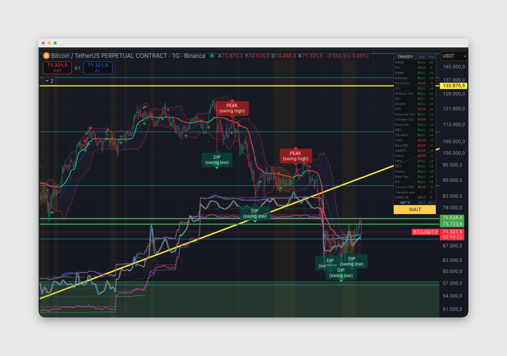

# TRADDY — One script. Full stack indicator. Zero guesswork on the score.

TradingView **Pine Script v5** overlay: KAMA, Bollinger, squeeze, a **weighted multi-indicator consensus** (−100% … +100%), **swing DIP/PEAK** markers, optional **consensus tier** shapes, **EXIT** logic, bottom **RSI · MACD · Stochastic** strips, dashboard, and alerts.

## Features 

### Consensus score
- Many inputs (MACD, RSI, KAMA, BB, Stoch, CCI, MFI, ADX, PPO, AO, UO, EFI, OBV, TSI/ROC, CMO, StochRSI, VWAP%, Fisher, TRIX, DPO, Vortex, Elder Ray, RVI, Connors-style RSI, squeeze pop, KAMA ER) each vote **BULL / BEAR / NEUT** with **weights** (group 3; weight **0** = off).
- **NET %** → verdict: **STRONG BUY / BUY / WAIT / SELL / STRONG SELL** (thresholds in group 1).
- Optional **choppiness damping** when chop is high.

### Chart signals (group 2)
- **Mode:** *Swing DIP / PEAK* or *Consensus tiers* (triangles/labels).
- **DIP / PEAK:** Pivot-based swings filtered by RSI, net %, BB proximity; **density** presets (Sparse / Balanced / More / Custom).
- **No PEAK until after a DIP** (default): avoids many red PEAK labels in one rally.
- **DIP falling-knife filter:** Bounce from prior DIP low before next DIP; stricter RSI when price is below a falling KAMA.
- **Consensus discipline:** One **BUY/STRONG BUY** until **SELL/STRONG SELL** or **EXIT** (reduces repeat BUY labels).
- **EXIT (orange):** **One shot** when net % **crosses below** your exit line, or **KAMA crossunder** (long), or tier fade to WAIT—not on every bar while net stays weak.
- Symmetric logic for shorts (EXIT SHORT, cross above KAMA, etc.).

### Visuals
- KAMA (color by slope), Bollinger + optional squeeze fill/background.
- Optional MACD cross marks on price.
- **Group 26:** RSI, Stochastic, MACD as **strips** at the bottom of the pane (linear scale recommended).

### Dashboard
- Table: per-component side, points, NET %, chop, final verdict.

### Alerts (group 25)
- DIP, PEAK (swing mode), STRONG BUY/BUY/SELL/STRONG SELL (gated), **EXIT**.

---

## Settings quick map

1. Score thresholds  
2. Chart signals (mode, DIP/PEAK, consensus, EXIT, discipline)  
3. Score weights  
4–22. Per-study parameters  
23. Lines · BB  
24. Dashboard  
25. Alerts  
26. Bottom oscillator strips  

---

## Disclaimer

Educational / informational only. Not financial advice. Trade at your own risk.

**License:** MPL-2.0 (see script header).
